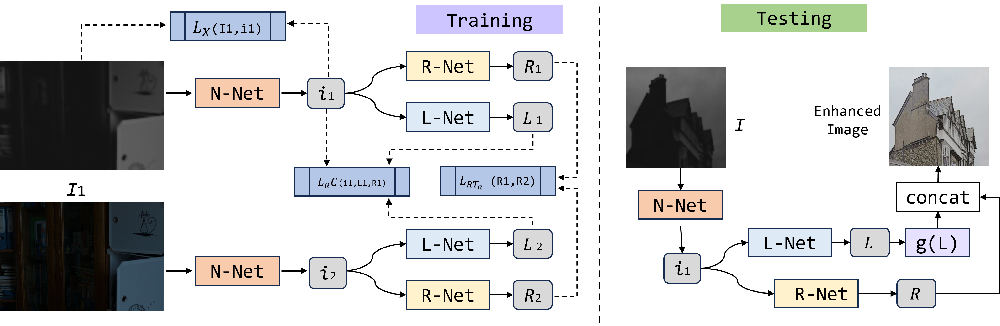

# HiDeNet: Improving Decomposition Conditioning for Paired Self-Supervised Low-Light Enhancement

## Note
This repository contains the official implementation of "**HiDeNet: Improving Decomposition Conditioning for Paired Self-Supervised Low-Light Enhancement**," which is currently under review for publication in *PeerJ Computer Science*. 

The entire codebase has been open-sourced to facilitate review and community exploration.

---

## 1. Overview and Framework



Low-light image enhancement is essential for transforming severely degraded visual inputs into high-quality representations for both human perception and downstream vision tasks. Current unsupervised and self-supervised Retinex variants often introduce over-smoothing artifacts or suffer from severe noise amplification. Furthermore, existing methods frequently rely on heavy downstream refinement networks that incur prohibitive computational overheads.

To address these challenges, we present **HiDeNet**, a streamlined, single-stage paired self-supervised image restoration framework. HiDeNet stabilizes decomposition conditioning directly within the initial feature representation phase. 

### Key Highlights:
* **Architectural Efficiency:** Integrates an asymmetric multi-scale extraction block (**MultiScaleBlock**) and a progressive hierarchical fusion mechanism (**HierarchicalFusion**).
* **Extreme Lightness:** Achieves an optimized balance with only **1.25M parameters** and **15.62G FLOPs**.
* **Real-time Inference:** Executes at an average single-frame inference runtime of a mere **8.5ms (>110 FPS)** on an NVIDIA RTX 4090 GPU.
* **Zero-Shot Downstream Boost:** Acting as a frozen pre-processing module without task-specific fine-tuning, it drives downstream YOLOv8 object detection mAP@0.5 from a compromised baseline of **22.3%** up to an optimal peak of **53.2%**.

---

## 2. Dataset Information
The model is trained and evaluated exclusively on the official partitions of two publicly available datasets:
* **LOL (Low-Light) Dataset:** Utilizing the extremely dark scenes for extreme exposure recovery training (comprising 485 training pairs).
* **SICE Dataset:** Utilized to ensure structural generalization across varied degradation levels.

> *Note: The framework strictly employs the low-light images from these datasets for self-supervised optimization. No normal-light ground truths are used during training, and the model maintains zero exposure to downstream detection datasets or bounding box annotations.*

---

## 3. Code Structure
The codebase is implemented in PyTorch. The directory is structured to facilitate easy reproduction:
* `HiDeNet/main.py`: The main entry point for managing the training lifecycle and executing testing/inference.
* `HiDeNet/data.py`: The data preprocessing pipeline, implementing element-wise photometric synthesis.
* `HiDeNet/dataset.py`: Encapsulates the PyTorch `Dataset` class, applying synchronized geometric augmentations.
* `HiDeNet/net/net.py`: Contains the core architectural definitions **MultiScaleBlock** and **HierarchicalFusion**.
* `HiDeNet/utils.py`: Utility functions, including optimizer initialization and the Reflectance Consistency constraint ($L_{RC}$).
* `HiDeNet/eval.py`: The evaluation script used to automate quality assessment and drive downstream detection tasks.
* `HiDeNet/measure.py`: The metric calculation module (PSNR, SSIM, LPIPS, and downstream mAP).

---

## 4. Usage Instructions

### Requirements
To run this code, a system equipped with a CUDA-enabled GPU is required, along with the following dependencies:
* Python $\ge$ 3.8
* PyTorch $\ge$ 1.12.0
* Torchvision, OpenCV (**opencv-python**), NumPy
* Ultralytics (Required for executing the downstream object detection accuracy measurements)

```bash
pip install -r requirements.txt
